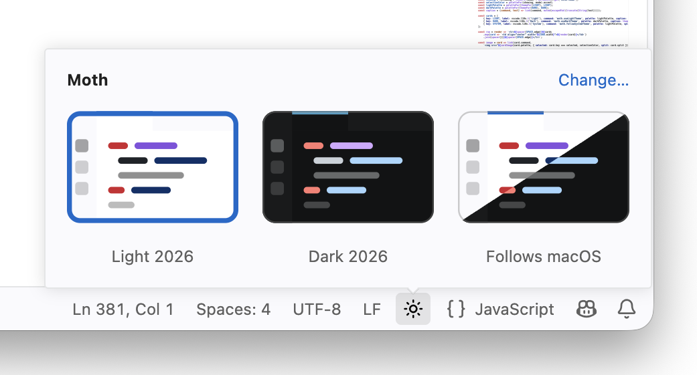

# Moth

A Visual Studio Code extension that brings the editor's quality-of-life
settings within reach.

 

## Description

Moth gives you quick access to obscure settings inside Visual Studio Code, so
you spend less time digging through the Command Palette and the Settings
editor.

Moth only changes local settings and has no external dependencies, so it works
fully offline. If you uninstall it later (if you lack taste), every setting it
changed stays as you left it.

 

## Features

### Theme switcher

Moth adds a button to the status bar for switching between themes. Click it to
toggle between your light and dark themes, or hover over it to open a panel
where you can pick a mode or choose which theme each mode uses.

 
Preview of the theme switcher

 

## Documentation

[User Manual](https://github.com/imgaty/Moth/blob/main/docs/USER-MANUAL.md) |
[Features](https://github.com/imgaty/Moth/blob/main/docs/FEATURES.md) |
[Contributing](https://github.com/imgaty/Moth/blob/main/CONTRIBUTING.md) |
[Changelog](https://github.com/imgaty/Moth/blob/main/CHANGELOG.md)

The icon sets and their licenses are listed in the
[Third-Party Notices](https://github.com/imgaty/Moth/blob/main/THIRD-PARTY-NOTICES.md).

 

## License

[MIT](LICENSE)
